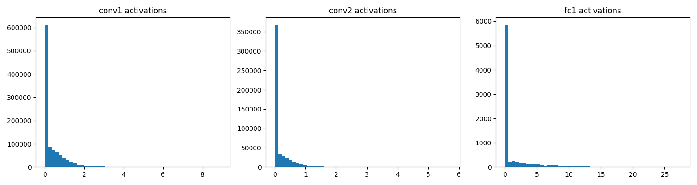
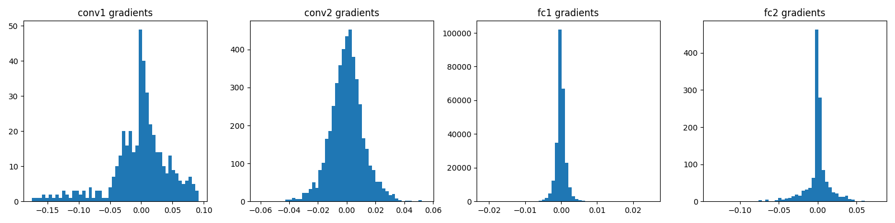
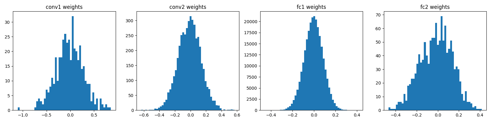
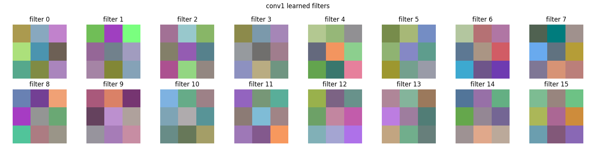

# CIFAR-10 CNN Classifier

A convolutional neural network built in PyTorch that classifies 32x32 color images into 10 categories. This project is the Python training artifact for a larger bridge project (PyTorch -> ONNX -> C++ inference -> FastAPI -> Docker -> EC2). The model is trained here, exported to ONNX, and later consumed by a C++ inference layer.

The repository is structured so that the trained model file produced at the end is exactly the input the deployment pipeline needs. No throwaway work.

## Table of Contents

1. [What This Project Does](#what-this-project-does)
2. [Results](#results)
3. [Architecture](#architecture)
4. [The Dataset](#the-dataset)
5. [Data Normalization](#data-normalization)
6. [Weight Initialization: Kaiming](#weight-initialization-kaiming)
7. [Batch Normalization](#batch-normalization)
8. [The Training Loop](#the-training-loop)
9. [Diagnostics](#diagnostics)
10. [Known Issues and Next Steps](#known-issues-and-next-steps)
11. [Project Structure](#project-structure)
12. [How to Run](#how-to-run)
13. [Configuration](#configuration)
14. [ONNX Export](#onnx-export)

## What This Project Does

The network takes a tiny 32x32 pixel color image and predicts which of 10 classes it belongs to: airplane, automobile, bird, cat, deer, dog, frog, horse, ship, or truck.

Under the hood it does what every neural network does. An input flows forward through layers, each layer applies a linear transformation followed by a nonlinearity, and a final layer produces 10 scores. The highest score is the prediction. During training the network compares its prediction to the true label, measures how wrong it is, computes how every weight contributed to that error, and nudges each weight slightly to reduce the error. Repeat this a few thousand times and the weights settle into values that classify images correctly.

The difference between this and a plain fully connected network is the use of convolutional layers. A convolutional layer slides small learnable filters across the image and detects spatial patterns like edges, textures, and color transitions. A plain linear layer flattens the image and loses all spatial structure. Convolutions preserve the 2D layout and understand that neighboring pixels are related, which is why they dominate image tasks.

## Results

Trained for 10 epochs on CPU with the small architecture (16 and 32 conv filters, 128 hidden units).

Overall test accuracy: **67.71%**

Per-class accuracy:

| Class | Accuracy |
|-------|----------|
| airplane | 72.1% |
| automobile | 76.3% |
| bird | 55.2% |
| cat | 54.9% |
| deer | 57.7% |
| dog | 52.1% |
| frog | 83.1% |
| horse | 68.6% |
| ship | 80.8% |
| truck | 76.3% |

For reference, random guessing on 10 classes gives 10 percent. Strong published CIFAR-10 models reach above 90 percent using deeper architectures, residual connections, data augmentation, and longer training. The goal here was to learn and build the full pipeline end to end, not to chase state of the art numbers.

The per-class breakdown tells a clear story. Rigid geometric objects like ships, automobiles, trucks, and frogs score high because they have distinctive shapes and colors that survive downscaling to 32x32. Organic categories that look similar to each other at low resolution, especially cat and dog, sit near coin-flip territory. Even a human struggles to tell a 32x32 cat from a 32x32 dog, so this failure mode is expected.

## Architecture

The forward pass moves through this sequence:

```
Input image                          [3, 32, 32]
  Conv2d(3 -> 16, kernel 3, pad 1)
  BatchNorm2d(16)
  ReLU
  MaxPool2d(2)                       [16, 16, 16]
  Conv2d(16 -> 32, kernel 3, pad 1)
  BatchNorm2d(32)
  ReLU
  MaxPool2d(2)                       [32, 8, 8]
  Flatten                            [2048]
  BatchNorm1d(2048)
  Linear(2048 -> 128)
  ReLU
  Linear(128 -> 10)                  [10]
```

Each piece has a specific job.

**Conv2d** is the sliding filter operation. The first convolution takes the 3 channel RGB image and produces 16 feature maps. Each of the 16 filters is a 3x3x3 grid of learnable weights (3x3 spatial across all 3 input channels), so one filter holds 27 weights. The filter slides across the image, and at each position it multiplies its weights against the pixels underneath and sums them into a single output number. Slide it everywhere and you get one feature map. Sixteen filters produce sixteen feature maps. The second convolution takes those 16 maps and produces 32 higher level maps that combine the simple patterns from the first layer into more complex ones.

**Padding of 1** with a 3x3 kernel keeps the spatial size unchanged. Without padding, a 3x3 filter cannot center on the border pixels, so a 32x32 input would shrink to 30x30 after each convolution. Padding adds a one pixel border of zeros so the output stays 32x32 and no information at the edges is lost.

**ReLU** is the nonlinearity. It is simply max(0, x). Positive values pass through untouched, negative values become zero. Without a nonlinearity between layers, stacking multiple linear transformations would collapse into a single linear transformation and the network could not learn complex patterns. ReLU was chosen over tanh because it is cheaper to compute and does not saturate for large positive inputs, which avoids the vanishing gradient problem that plagues tanh at its tails.

**MaxPool2d(2)** downsamples each feature map by taking a 2x2 window, keeping only the maximum value, and discarding the other three. This halves the spatial dimensions, so 32x32 becomes 16x16 and then 8x8. Pooling does three useful things. It reduces computation because smaller maps are cheaper to process. It provides translation invariance, meaning a feature shifted by a pixel or two still registers, because pooling cares about whether a feature exists in a region rather than at an exact location. And it enlarges the effective receptive field of later layers, so deeper filters see a larger portion of the original image.

**Flatten** reshapes the final [32, 8, 8] tensor into a single 2048 element vector, because the linear layers that follow expect a flat input rather than a grid. The number 2048 comes directly from the architecture: 32 feature maps times 8 by 8 spatial size.

**Linear** layers are fully connected. Every output neuron connects to every input value. The first linear layer compresses the 2048 features down to 128, learning which combinations of detected features matter. The second linear layer maps those 128 values to 10 class scores. The final layer has no activation because the output needs to be unconstrained. Applying a squashing function there would limit the range of scores that feed into the loss function.

All architecture constants live at the top of `src/model.py` as named variables (`KERNEL_SIZE`, `INPUT_CHANNELS`, `CONV1_FILTERS`, `CONV2_FILTERS`, `FC1_SIZE`) so anyone can experiment by editing one place instead of hunting through the code for magic numbers.

## The Dataset

CIFAR-10 contains 60,000 color images split into 50,000 for training and 10,000 for testing. Each image is 32x32 pixels with 3 color channels, giving 32 times 32 times 3 equals 3072 numbers per image. The images are deliberately tiny so training runs quickly on modest hardware while still being rich enough to require real feature learning, unlike MNIST which is nearly solved by simple models.

Each image is stored in PyTorch as a tensor of shape [3, 32, 32]. The channels come first by convention because this memory layout is more efficient for the convolution operations. Matplotlib and PIL expect channels last, shape [32, 32, 3], which is why visualizing an image requires a permute to rearrange the dimensions.

The labels are integers from 0 to 9, each mapping to one class: 0 airplane, 1 automobile, 2 bird, 3 cat, 4 deer, 5 dog, 6 frog, 7 horse, 8 ship, 9 truck.

## Data Normalization

Raw image pixels are stored as integers from 0 to 255. The first transform, `ToTensor()`, does two things. It scales every pixel by dividing by 255 so values land in the range 0.0 to 1.0, because neural networks train more stably with small inputs. It also rearranges the dimensions from the PIL layout to the PyTorch channels first layout.

The second transform, `Normalize`, shifts and scales each channel so it has roughly zero mean and unit standard deviation across the dataset. The exact per channel values used here are the standard published CIFAR-10 statistics:

```
mean = (0.4914, 0.4822, 0.4465)
std  = (0.2470, 0.2435, 0.2616)
```

These are not guessed. They are the actual mean and standard deviation of the entire training set computed per color channel. The formula applied to each pixel is (pixel minus mean) divided by std. Centering the data at zero matters because it keeps the inputs to the first layer balanced around zero rather than all positive. This prevents the pre-activation values from being systematically pushed in one direction, which in turn keeps neurons from dying and helps gradients flow evenly during backpropagation.

For a custom dataset you would compute these statistics yourself by looping over all images once with only `ToTensor()` applied, accumulating the per channel mean and std, then hardcoding the results. For CIFAR-10 the values are well known so this step is skipped.

## Weight Initialization: Kaiming

When a network is created its weights start random. The scale of that randomness matters enormously. If the initial weights are too large, activations and gradients grow as they pass through layers and training becomes unstable. If they are too small, signals shrink toward zero and the deeper layers barely learn. Getting initialization right means gradients stay at a healthy magnitude across every layer from the very first step.

Kaiming initialization (also called He initialization) sets the scale of the random weights based on the number of inputs to each layer, specifically tuned for ReLU nonlinearities. Because ReLU zeroes out roughly half of its inputs, Kaiming compensates by scaling the weights so that the variance of the activations is preserved as they flow forward through the network. This is the same reasoning Karpathy walks through in the makemore series when he computes the gain factor for a given nonlinearity by hand.

In this project Kaiming normal initialization is applied to every convolutional and linear weight right after the model is created and before training begins:

```python
nn.init.kaiming_normal_(model.conv1.weight)
nn.init.kaiming_normal_(model.conv2.weight)
nn.init.kaiming_normal_(model.fc1.weight)
nn.init.kaiming_normal_(model.fc2.weight)
```

Applying it before any training happens is the point. It sets the network up in a good starting position so the first gradient steps are productive rather than wasted correcting a bad scale.

## Batch Normalization

Kaiming initialization sets a good starting scale, but as training proceeds and weights change, the distribution of values flowing between layers drifts. Some layers can end up receiving inputs that are too large or too small, which starves neurons of signal and creates dead neurons. Batch normalization fixes this dynamically throughout training.

A batch normalization layer takes the values flowing through it and normalizes them to have roughly zero mean and unit standard deviation, computed across the current batch. It then applies two learnable parameters, a scale and a shift, so the network can undo the normalization if that turns out to be useful. The effect is that every layer receives inputs in a consistent, centered range no matter how the earlier weights evolve. This keeps signals healthy, prevents neurons from dying, and lets the network train faster and more reliably.

This project uses three batch normalization layers. `BatchNorm2d(16)` and `BatchNorm2d(32)` normalize the outputs of the two convolutional layers. The 2d variant is used because the data is still shaped as image feature maps and normalization happens per channel. `BatchNorm1d(2048)` normalizes the flattened vector just before the first linear layer. The 1d variant is used because the data at that point is a flat vector rather than a spatial grid.

The order within each block is Conv, BatchNorm, ReLU, Pool. Batch normalization comes before ReLU so that the full distribution of values is centered and scaled before the negative half is chopped off. Pooling comes last because it is just downsampling and should happen after the meaningful transformations are complete.

### Why batch normalization was added

The need for batch normalization was discovered through diagnostics, not assumed up front. An early version of the network without batch normalization was checked for dead neurons. The result showed that the first fully connected layer had 59 out of 128 neurons dead, meaning 46 percent of that layer never fired for any input in the test batch. The data reaching that layer had passed through two ReLU layers and pooling, arriving skewed and pushing nearly half the neurons permanently into the negative zone where ReLU outputs zero.

Adding batch normalization before the first linear layer fixed this. After the fix, the dead neuron count across all layers dropped to essentially zero, with only a couple of naturally dead filters in conv2, which is normal. This is a concrete example of the diagnose then fix loop that the makemore series emphasizes: measure the internal health of the network, find the problem, apply the targeted fix, and measure again to confirm.

## The Training Loop

The core loop is the same five step cycle that all gradient based learning uses, just scaled up to batches of images.

```python
for epoch in range(EPOCHS):
    for images, labels in trainloader:
        optimizer.zero_grad()
        out = model(images)
        loss = criterion(out, labels)
        loss.backward()
        optimizer.step()
```

**zero_grad** clears the gradients from the previous step. Gradients accumulate by default in PyTorch, so without clearing them each new backward pass would add on top of stale values and corrupt the update.

**forward pass** runs the batch of images through the network to produce predictions. The output tensor carries the full history of every operation that produced it, recorded as a computation graph. It is not just a number, it remembers how it was made.

**loss** measures how wrong the predictions are. This project uses `CrossEntropyLoss`, the standard choice for multi-class classification. It compares the 10 output scores against the correct label and produces a single number that is small when the prediction is confident and correct, and large otherwise. This replaces the mean squared error loss used for regression, because classification is about picking the right category rather than predicting a continuous value.

**backward** walks the computation graph in reverse from the loss back to every weight, applying the chain rule at each node to compute how much each weight contributed to the error. After this call every parameter has its gradient filled in.

**step** updates every weight using its gradient. This project uses the Adam optimizer, which is a smarter version of plain gradient descent. Where basic stochastic gradient descent subtracts a fixed learning rate times the gradient from each weight, Adam adapts the effective step size per parameter by tracking running estimates of the gradient and its variance. This usually converges faster and is a reliable default.

An **epoch** is one full pass through all 50,000 training images. With a batch size of 64 that is roughly 782 batches per epoch, and each batch performs one full cycle of the five steps above. Ten epochs therefore perform roughly 7,820 weight updates. The loss is averaged across all batches in an epoch and printed, which gives a smooth downward curve rather than the noisy per batch values.

Observed training loss per epoch:

```
epoch 0, avg loss: 1.3179
epoch 1, avg loss: 0.8881
epoch 2, avg loss: 0.7136
epoch 3, avg loss: 0.5821
epoch 4, avg loss: 0.4725
epoch 5, avg loss: 0.3744
epoch 6, avg loss: 0.3062
epoch 7, avg loss: 0.2551
epoch 8, avg loss: 0.2068
epoch 9, avg loss: 0.1834
```

## Diagnostics

Rather than treating the network as a black box, this project includes four diagnostic scripts that visualize its internal health. This is directly inspired by the makemore approach of plotting activations, gradients, and weights to understand what is actually happening inside the model. Each script loads the trained checkpoint and produces a plot saved to the outputs folder.

### Activation distributions (`diagnostics/activations.py`)



This grabs one batch, runs it forward through the network, and histograms the post-ReLU activations of each layer. It also counts dead neurons, meaning neurons whose output is zero for every image in the batch.

What to look for is the shape of the distribution. A spike at zero is normal and expected with ReLU, since every negative pre-activation becomes exactly zero. The concern is how dominant that spike is and whether there is a healthy spread of positive values alongside it. The plots show a strong zero spike with a long positive tail, which is typical for ReLU networks. The dead neuron count after adding batch normalization is essentially zero, confirming the layers are healthy.

### Gradient distributions (`diagnostics/gradients.py`)



This runs one batch forward, computes the loss, calls backward, and histograms the gradient of each layer's weights. The point is to check whether gradients are flowing evenly through the whole network.

If early layers had gradients hundreds of times smaller than late layers, that would signal vanishing gradients and mean the early layers are barely learning. If they were hundreds of times larger, that would signal exploding gradients and instability. The plots show the convolutional layers with a healthy spread and the fully connected layers more concentrated near zero. The concentration in the first fully connected layer is partly a visual artifact of its enormous parameter count. That layer has 2048 times 128 equals 262,144 weights, so even a well behaved distribution produces a very tall central bar compared to a convolutional layer with only a few hundred weights.

### Weight distributions (`diagnostics/weights.py`)



This is the simplest diagnostic. It loads the model and histograms the actual weight values of each layer, no data or forward pass required.

Healthy weights form a bell shape centered near zero with a reasonable spread. Weights collapsed near zero would mean a layer is doing nothing. Weights blown up to large magnitudes would mean instability and fragility. The plots show clean bell curves centered at zero across all four layers, roughly in the range of negative 0.5 to 0.5. The first convolutional layer looks slightly jagged only because it has very few weights to fill the histogram, not because anything is wrong.

### Filter visualization (`diagnostics/filters.py`)




This extracts the 16 filters of the first convolutional layer, normalizes their weights to the 0 to 1 range so they can be displayed as images, and shows them as a grid of tiny 3x3 color patches.

Each patch is a pattern the network learned to detect. Some show clear directional contrast, meaning they detect edges oriented a certain way. Others show color oppositions, meaning they detect transitions between colors. This confirms the network learned meaningful, varied feature detectors rather than noise. It is a well known result that the first layer of a convolutional network almost always converges to edge and color detectors regardless of the dataset, and this project reproduces that.

## Known Issues and Next Steps

The model works but is not optimal, and the diagnostics make the limitations visible.

**Overfitting.** The training loss reaches 0.18 while the test accuracy is only 67.71 percent. This gap indicates the model is memorizing training data faster than it is learning to generalize. A larger version tested earlier (32 and 64 filters, 256 hidden units) drove training loss even lower to 0.09 but did not improve test accuracy, which is textbook overfitting. The smaller architecture was kept precisely because it generalizes slightly better.

**Weak classes.** Cat and dog sit near 50 percent, which is close to a coin flip within the pairs of animals they get confused with. This is partly inherent to 32x32 resolution but could be improved.

Concrete improvements worth trying, roughly in order of expected payoff:

1. **Data augmentation.** Randomly flip, crop, and shift training images so the network sees more variation and cannot simply memorize exact pixels. This is usually the single biggest accuracy improvement for CIFAR-10.
2. **Dropout.** Randomly zero a fraction of neurons during training so the network cannot rely on any single neuron and is forced to spread learning across many. This directly attacks overfitting.
3. **LeakyReLU.** Replace ReLU with a variant that lets a small negative slope through instead of hard zeroing, which reduces dead neurons.
4. **Deeper architecture.** Add more convolutional layers or adopt residual connections to increase capacity in a way that generalizes.
5. **Longer training with a learning rate schedule.** Train for more epochs while gradually reducing the learning rate so the model settles into a better minimum.
6. **A confusion matrix.** Build one to see exactly which class pairs get mixed up, which would guide targeted fixes.

## Project Structure

```
cifar10-cnn/
  README.md
  requirements.txt
  .gitignore
  src/
    config.py          hyperparameters, paths, dataset constants
    model.py           MyNet class definition and architecture constants
    train.py           data loading, training loop, checkpoint saving
    evaluate.py        overall and per-class test accuracy
    export_onnx.py     load checkpoint, export to ONNX, verify
  diagnostics/
    activations.py     activation histograms and dead neuron count
    gradients.py       gradient distribution histograms
    weights.py         weight distribution histograms
    filters.py         first layer filter visualization
  data/                CIFAR-10 downloads here (gitignored)
  checkpoints/         .pth checkpoint files (gitignored)
  outputs/             .onnx export and diagnostic plots (gitignored)
```

The separation of concerns is deliberate. Configuration is centralized so there are no magic numbers scattered through the code. The model definition holds only the architecture. Each script in src does exactly one job. Diagnostics are kept separate from the core pipeline so they do not clutter training. Generated files (data, checkpoints, outputs) are kept out of version control.

## How to Run

Set up a virtual environment and install dependencies:

```bash
python3 -m venv ~/pytorch-env
source ~/pytorch-env/bin/activate
pip install -r requirements.txt
```

Run the pipeline in order from the project root. Each script is run as a module so the imports from src resolve correctly:

```bash
python3 -m src.train         # trains and saves a checkpoint
python3 -m src.evaluate      # prints overall and per-class accuracy
python3 -m src.export_onnx   # exports and verifies the ONNX model
```

Optionally run the diagnostics to inspect internal health:

```bash
python3 -m diagnostics.activations
python3 -m diagnostics.gradients
python3 -m diagnostics.weights
python3 -m diagnostics.filters
```

The CIFAR-10 dataset downloads automatically on the first run into the data folder. This is a one time download of roughly 170 MB.

## Configuration

All tunable values live in `src/config.py`. Change them there and every script picks up the new values automatically.

| Setting | Value | Meaning |
|---------|-------|---------|
| BATCH_SIZE | 64 | images processed per training step |
| LEARNING_RATE | 0.001 | Adam step size |
| EPOCHS | 10 | full passes over the training set |
| NORM_MEAN | (0.4914, 0.4822, 0.4465) | per-channel mean for normalization |
| NORM_STD | (0.2470, 0.2435, 0.2616) | per-channel std for normalization |
| NUM_CLASSES | 10 | number of output categories |

Architecture constants (filter counts, kernel size, hidden layer width) live at the top of `src/model.py` so the model shape can be experimented with independently of the training hyperparameters.

## ONNX Export

After training, the model is exported to the ONNX format, which is a portable representation of the network that other runtimes can load, including C++ inference engines. The export takes the trained model in evaluation mode and traces it with a dummy input of the correct shape [1, 3, 32, 32] to record the full graph of operations.

The export is then verified by loading the ONNX file with onnxruntime and running the same dummy input through it, confirming that it produces valid output scores. Setting the model to evaluation mode before export is important because it switches batch normalization from using per batch statistics to using the fixed running statistics it accumulated during training, which is the correct behavior for inference.

The resulting `cifar10_cnn.onnx` file is the handoff point to the deployment pipeline. It is exactly the artifact the C++ inference layer loads in the next stage of the bridge project.
